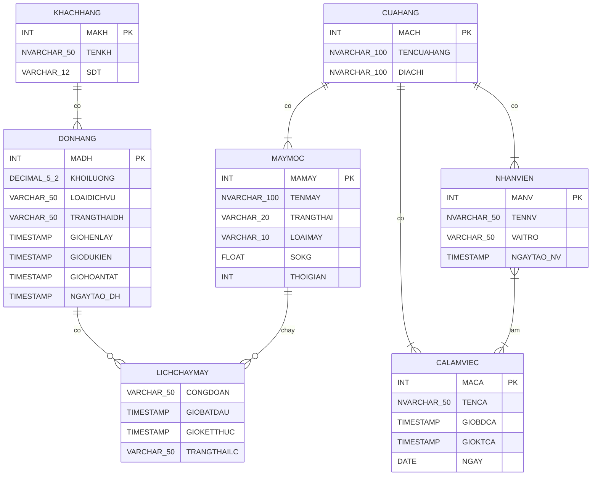

# ERD - Hệ thống quản lý cửa hàng giặt ủi

```mermaid
erDiagram

    KHACHHANG {
        INT MAKH PK
        NVARCHAR_50 TENKH
        VARCHAR_12 SDT
    }

    DONHANG {
        INT MADH PK
        DECIMAL_5_2 KHOILUONG
        VARCHAR_50 LOAIDICHVU
        VARCHAR_50 TRANGTHAIDH
        TIMESTAMP GIOHENLAY
        TIMESTAMP GIODUKIEN
        TIMESTAMP GIOHOANTAT
        TIMESTAMP NGAYTAO_DH
    }

    LICHCHAYMAY {
        VARCHAR_50 CONGDOAN
        TIMESTAMP GIOBATDAU
        TIMESTAMP GIOKETTHUC
        VARCHAR_50 TRANGTHAILC
    }

    MAYMOC {
        INT MAMAY PK
        NVARCHAR_100 TENMAY
        VARCHAR_20 TRANGTHAI
        VARCHAR_10 LOAIMAY
        FLOAT SOKG
        INT THOIGIAN
    }

    NHANVIEN {
        INT MANV PK
        NVARCHAR_50 TENNV
        VARCHAR_50 VAITRO
        TIMESTAMP NGAYTAO_NV
    }

    CALAMVIEC {
        INT MACA PK
        NVARCHAR_50 TENCA
        TIMESTAMP GIOBDCA
        TIMESTAMP GIOKTCA
        DATE NGAY
    }

    CUAHANG {
        INT MACH PK
        NVARCHAR_100 TENCUAHANG
        NVARCHAR_100 DIACHI
    }

    KHACHHANG ||--|{ DONHANG : "co"

    DONHANG ||--o{ LICHCHAYMAY : "co"

    MAYMOC ||--o{ LICHCHAYMAY : "chay"

    CUAHANG ||--|{ MAYMOC : "co"

    CUAHANG ||--|{ NHANVIEN : "co"

    CUAHANG ||--|{ CALAMVIEC : "co"

    NHANVIEN }|--|{ CALAMVIEC : "lam"
```

## Trạng thái

### Đơn hàng

- Chờ
- Đang giặt
- Đang sấy
- Sẵn sàng
- Đã thông báo
- Hoàn tất

### Lịch chạy máy

- Đang chạy
- Hoàn tất